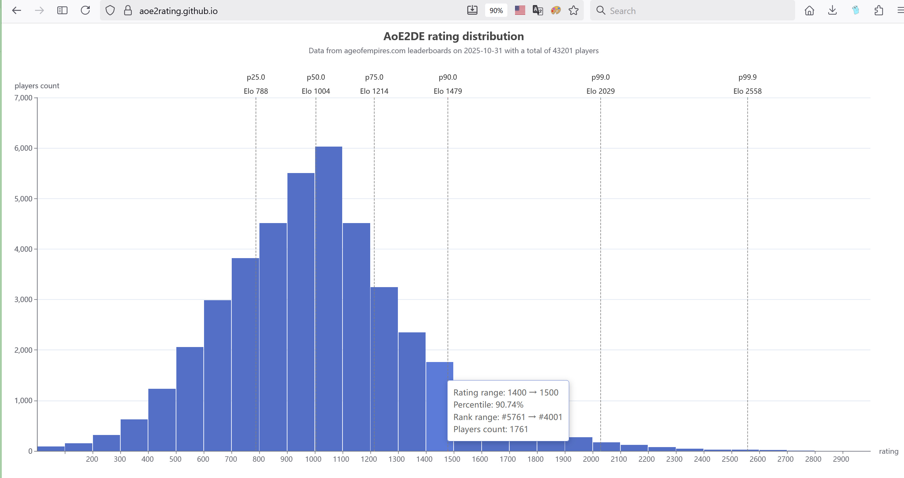

# AoE2DE rating distribution

Data from ageofempires.com leaderboards.

Need to be updated manually by running [z_aoe2_rating_percentile.go](z_aoe2_rating_percentile.go),  
the [index.html](index.html) will be updated to newest data after running the script.

On 2025-10-31, the data looks like this:

